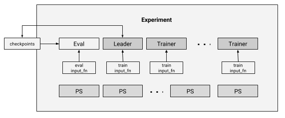

```{r setup, include=FALSE}
knitr::opts_chunk$set(echo = TRUE)
```

TensorFlow experiments are used to bundle together all of the different pieces needed to train, evaluate, and predict using a TensorFlow estimator. An experiment bundles together:

1. An estimator, which defines the underlying model,
2. A 'training' input function, used for training the model,
3. A 'eval' input function, used for evaluating the performance of the model,
4. Various parameters that control how the model should be trained and evaluated,
5. Monitors and metrics, which can be used to monitor the progression of an
   experiment's progress as it is trained and evaluated.
   
The `Experiment` is the core to the distributed execution. In each TensorFlow cluster, there are several parameter servers and several worker tasks. Most workers are handing the training process, which basically calls the Estimator `train()` with the training `input_fn`. One of the workers is designated leader and is responsible for managing checkpoints and other maintenance work. Currently, the primary mode of replica training in TensorFlow Estimators is between-graph replication and asynchronous training. However, it could be easily extended to support other replicated training settings. With this architecture, gradient descent training can be executed in parallel. Please read our [white paper](http://terrytangyuan.github.io/data/papers/tf-estimators-kdd-paper.pdf) if you are interested in the details of the design. 

The architecture of `Experiment` is summarized in the figure below:

{.screenshot}

For example, we firstly construct a classifier

``` r
clf <-
  dnn_linear_combined_classifier(
    linear_feature_columns = linear_feature_columns,
    dnn_feature_columns = dnn_feature_columns,
    dnn_hidden_units = c(3L, 3L),
    dnn_optimizer = "Adagrad"
  )
  
```

and then we pass the classifier into `experiment()` together with other neccessary information, such as separate input functions for training and evaluation, training and avaluation steps, etc. Then we can call `train_and_evaluate()` to conduct the experiment by running training and evaluation altogether.

``` r

experiment <- experiment(
  clf,
  train_input_fn = custom_train_input_fn,
  eval_input_fn = custom_eval_input_fn,
  train_steps = 3L,
  eval_steps = 3L,
  continuous_eval_throttle_secs = 60L
)

experiment_result <- train_and_evaluate(experiment)
```

The following functions are available for working with experiments:

| Method  | Description |
|---------------------------------------|----------------------------------------------------------------|
| `experiment()`  |  Create an experiment.  |
| `train()`  |  Training method for experiments. |
| `evaluate()`  |  Evaluation method for experiments. |
| `train_and_evaluate()`  |  Interleave training and evaluation. |


