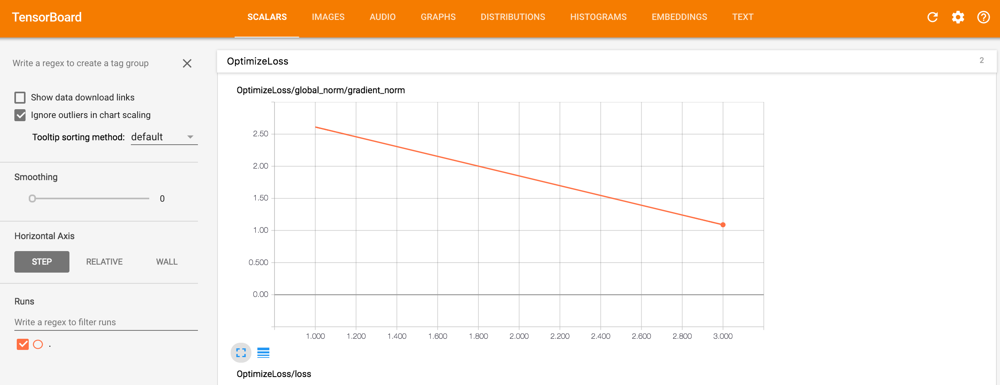
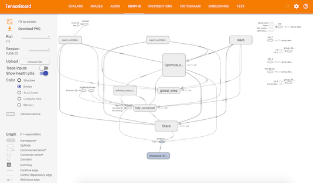
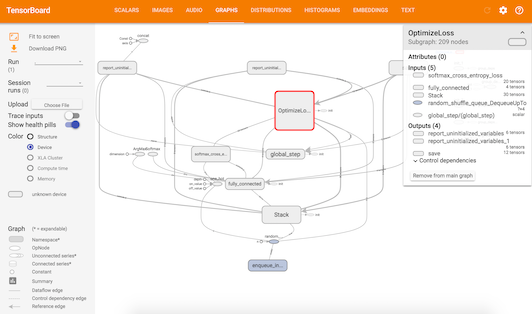

```{r setup, include = FALSE}
library(tfestimators)
knitr::opts_chunk$set(comment = NA, eval = FALSE)
```

## Overview

TensorBoard is a visualization tool included with TensorFlow that enables you to visualize your TensorFlow graph, plot quantitative metrics about the execution of your graph, and show additional data like images that pass through it.

Models built using tfestimators automatically contain most of the necessary information to visualize the TensorFlow graph, variables, etc., for you so you can easily launch the TensorBoard without additional manual specifications.

## Examples

To start the TensorBoard, you trained a model in a similar fashion as follows:

```{r}
estimator(
    model_fn = model_fn,
    model_dir = "/tmp/test"
) %>% train(input_fn = input, steps = 100L)

```

and then you can call

```
tensorboard(log_dir = "/tmp/test", launch_browser = TRUE)
```
with `log_dir` being the directory you used to save the model checkpoints, to launch the TensorBoard in browser. 

For example, here's a TensorBoard display for a model's training loss:

{width=750 height=545 .screenshot}


Here's another TensorBoard display for this model's TensorFlow graph that demonstrates the architecture of the model:

{width=750 height=545 .screenshot}


You can also click to see each subgraph's details:


{width=750 height=545 .screenshot}
